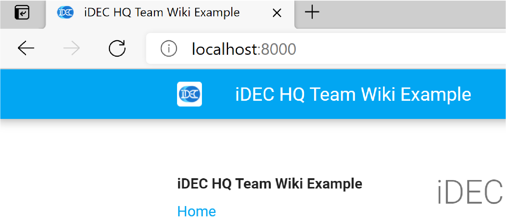
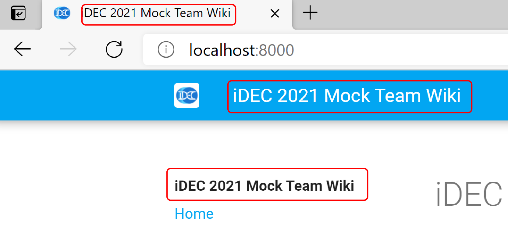
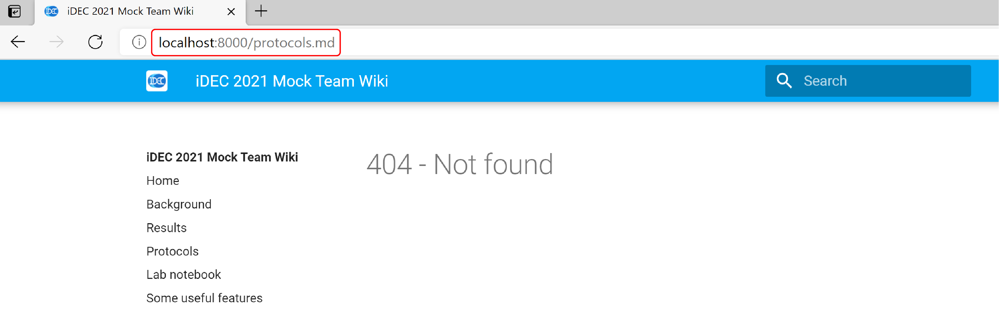
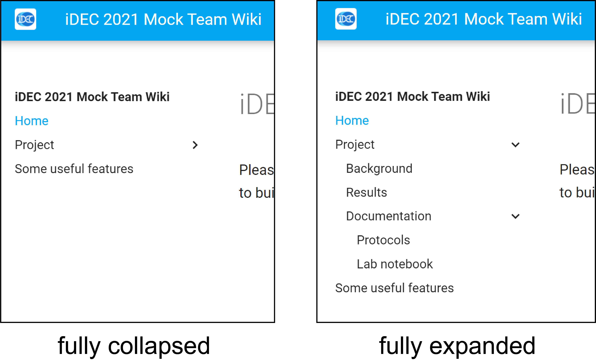
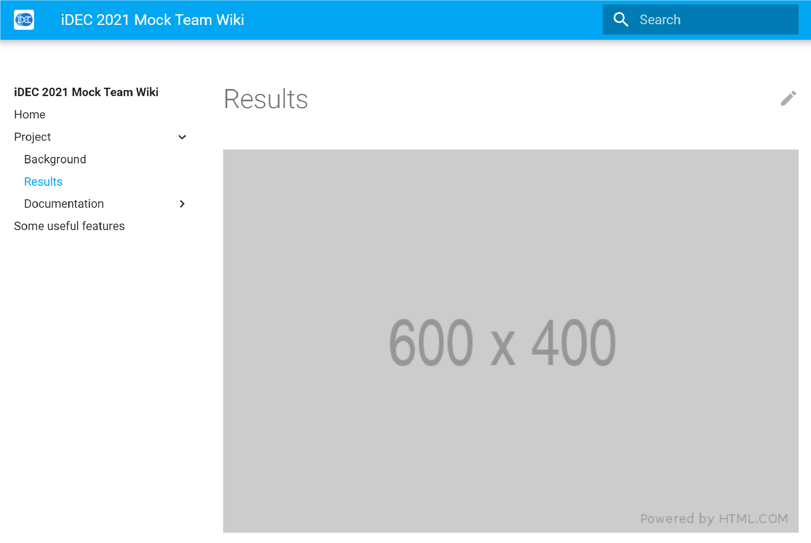
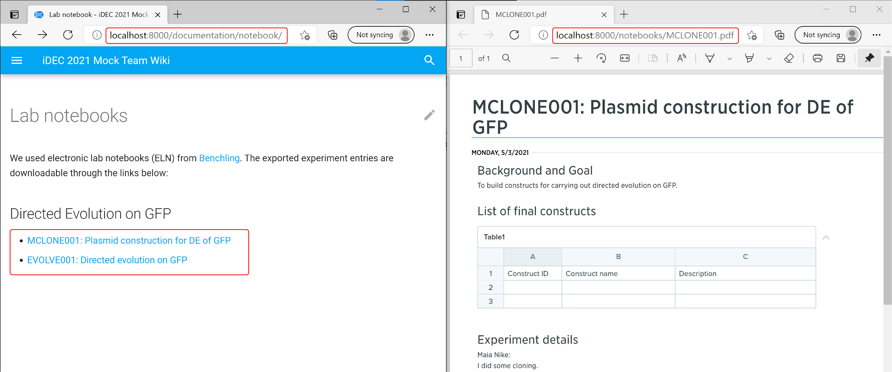
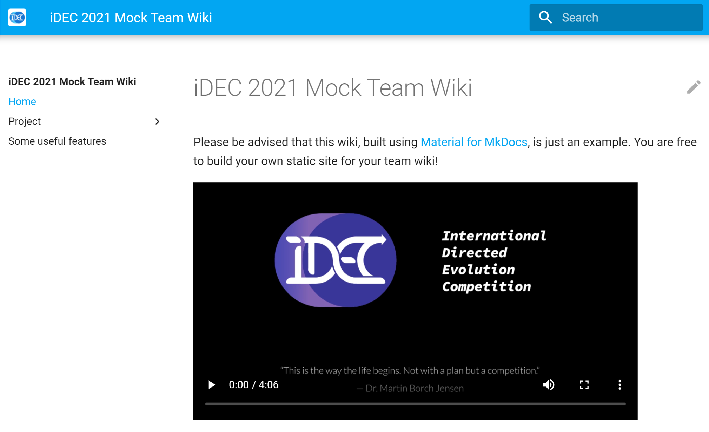

# Common operations in MkDocs

In this section, please make sure you have the live server up and running.  
You can refer to the previous page [Set up a Docker container for wiki editing] for the instructions.

This page covers the essential information you need to know to build your team wiki.

## Configure the wiki name

The default wiki name we give our template repository is "iDEC HQ Team Wiki Example".  
{ width=400px }  
To change it to a new name, use a plain text editor to open the file:
`mkdocs.yml`  
Look for the following configuration:
```yml
site_name: iDEC HQ Team Wiki Example
```
and change it to:
```yml
site_name: iDEC 2021 Mock Team Wiki
```
Refresh the live server, notice that 3 things should have changed:  
  
- browser tab title  
- wiki header title  
- wiki navigation bar header  
  
{ width=400px }  

!!! attention
    It is possible to change the favicon and icon of the wiki in `mkdocs.yml`.  
      
    However, if your team decide to use MkDocs for Material, or other static site generators with templates, we politely request that your use the iDEC favicon and logo, and keep our copyright statement. This is to show that your team wiki is part of iDEC. Thank you.

## Put pages on the navigation menu

If you click on the "Protocol" or the "Notebook" link in the navigation menu, you will land on to a `404 - Not found` page.  
{ width=600px }  
We will fix this now. Using an IDE or a text editor, open the `mkdocs.yml` file.  
Look for the following configuration:

```yml
nav:
  - Home: index.md
  - Background: background.md
  - Results: results.md
  - Protocols: protocols.md
  - Lab notebook: notebook.md
  - Some useful features: useful_features.md
```
!!! danger
    Failure to follow the proper use of whitespaces in each list item will result in links not being properly rendered.

Comparing this section with the navigation menu, you can see that, for each indented list item, the key (text before colon `:`) is the link label, and the value (text after colon) corresponds to the file path, which is **relative to**  the `docs/` folder.

The files for "Protocols" and "Notebook" actually exist - they are just sitting in the directory `docs/documentation/`.

```yml
.
└─docs
   └─documentation
      ├─notebook.md 
      └─protocols.md
```
So the solution is to fix the `mkdocs.yml` file, `nav` section as follow:

```yml
nav:
  - Home: index.md
  - Background: background.md
  - Results: results.md
  - Protocols: documentation/protocols.md
  - Lab notebook: documentation/notebook.md
  - Some useful features: useful_features.md
```

Return to the browser and the links should now be functional.
{ width=600px }  


## Create subsections in the navigation menu

If you have a lot of pages, you might want to group them together.  
In the `nav` section inside the `mkdocs.yml` file, make the following change:

```yml
nav:
  - Home: index.md
  - Project:
      - Background: background.md
      - Results: results.md
      - Documentation:
          - Protocols: documentation/protocols.md
          - Lab notebook: documentation/notebook.md
  - Some useful features: useful_features.md
```

Return to the browser. The menu should now have 3 levels, and can collapsed or expanded at different levels.

{ width=600px }  

Two important things to note in `mkdocs.yml`:  
  
1. The subsection must have a header but **without a file path**[^1]
2. Under the subsection, the list item is indented to the right by **exactly 4 whitespaces**

!!! tip
    Structuring your Markdown file locations and the navigation menu in the same way is highly recommended, since it will help your collaborators / teammates to find the location of the file much more easily.

!!! note
    The structure here is only for the illustration of increasing page depth. In general, we recommend that teams limit their wiki page depth to only 2 levels.  
    You will also notice that for your assigned team repository, your 2nd level pages are grouped under section headers instead. That is because we enabled the feature [Navigation Sections](https://squidfunk.github.io/mkdocs-material/setup/setting-up-navigation/#navigation-sections) in `mkdocs.yml`, which is more user-friendly when the total number of pages is small.

## Add an image

You will now add an image to the wiki, similar to how you would add figures for illustrations and results.
Save a [dummy image](https://via.placeholder.com/600x400) under the directory `docs/img` and name it as `dummy.png`  
Then, edit `docs/results.md`, and add the following code underneath the existing texts:

```
{ width=800px }
```

Return to the browser. You should now see the image being shown on the "Results" page.

{ width=600px }  

While the size of the figure was 600 pixels x 400 pixels, on the page it is stretched to 800 pixels in width. You can modify the image size by the attributes tag[^2] after the normal Markdown syntax for image insertion.

!!! note "Self-practice"
    Why not try creating a page called "Our Team", list your iDEC teammates and add their photos?

## Generate links to downloadable contents

In some cases you might have some information that are simply too long to be part of a webpage. Instead of displaying its full content, you might want to generate a link to the downloadable file instead. This can be done by placing the file somewhere under the `docs` folder and then pointing a hyperlink to it.  
  
Inspect the directory `docs` and you will see:

```yml
.
└──docs
   ├─documentation
   │  ├─notebook.md 
   │  └─protocols.md
   └─notebooks
      ├─MCLONE001.pdf 
      └─EVOLVE001.pdf
```

Assuming these are exported electronic notebook files, you will now create links to them on the page  
"Project -> Documentation -> Notebook", or,  
`http://localhost:8000/documentation/notebook/`  

Use a text editor and open `docs/notebook.md`, then insert the following lines underneath the existing content:  
```
- [MCLONE001: Plasmid construction for DE of GFP](../notebooks/MCLONE001.pdf){: target="_blank" }
- [EVOLVE001: Directed evolution on GFP](../notebooks/EVOLVE001.pdf){: target="_blank" }
```

So for the relative path `../notebooks/MCLONE001.pdf`, it works as follow:
1. Starts from `docs/documentation` where `notebook.md` is located
2. `../` = goes up 1 level to `docs`
3. `notebooks/MCLONE001.pdf` = goes into the `notebooks` folder and locate the `MCLONE001.pdf` file.
  
This relative path will work both on your location machine as well as the deployed GitHub Page.

Return to the browser and go to "Notebook" page, you will now find two links.
Click on any of them and you should see a new tab with the PDF file showing up.

{ width=800px }  

!!! tip
    Upload your files in formats that are OS-agnostic and not dependent on proprietary software. For example, use PDF instead of Word documents or Powerpoint files.

## Embed a video

Use of multimedia faciliates scientific communication to the lay public. To embed a video, use of HTML is necessary.

You already have a cover image in the repository.  
Download a sample video from this [link](https://drive.google.com/file/d/1boSkC91DsA2Ueh7IDEcudd-yfaeNPPyQ/view?usp=sharing).  
Then save the file as `iDEC_video.mp4` under the `docs/assets` directory:

```yml
.
└──docs
   ├─assets
   │  └─iDEC_video.mp4 
   └─img
      └─video_cover.png
```

To embed this on the "Home" page, open a text editor, insert the following code into the end of the file `docs/index.md` and save the file.

```html
<video controls width="600px" poster="img/video_cover.png">
    <source src="assets/iDEC_video.mp4" type="video/mp4">
</video>
```

In the code above, the `poster` attribute in the `<video>` element has a relative path pointing to the cover image of the video.  
The `src` attribute (which is a shorthand for "source") in the `<source>` element has a relative path pointing to the video itself.

Return to the browser and go to Home (`localhost:8000`), you will see the video being embedded.  

{ width=600px }  

!!! attention
    Make sure each individual file (whether document or video) does not exceed 100 MB in size, which is the limit for hosting by GitHub. Also, you should keep the size of your repository within 1 GB.

[^1]:
    Check out the Material for MkDocs [reference](https://squidfunk.github.io/mkdocs-material/setup/setting-up-navigation/#fn:2) on how to enable section index pages.
    This is however not recommended from a UX design perspective.
[^2]: Material for MkDocs [reference on images](https://squidfunk.github.io/mkdocs-material/reference/images/)