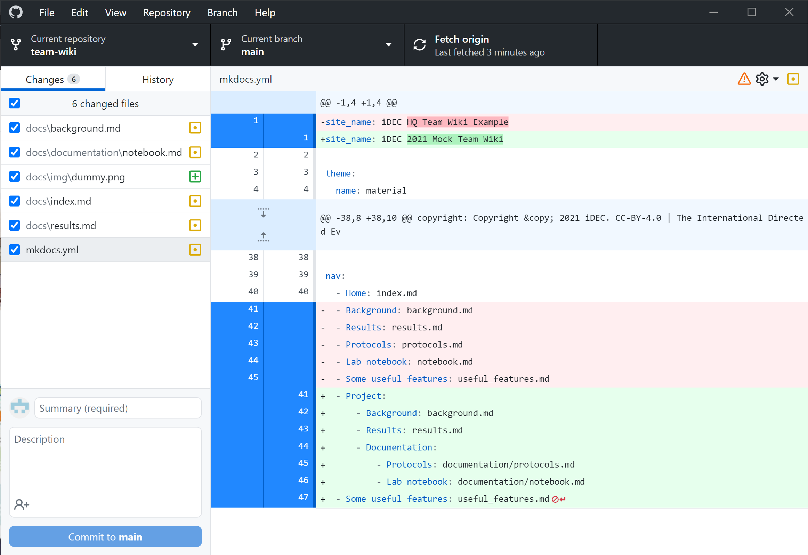
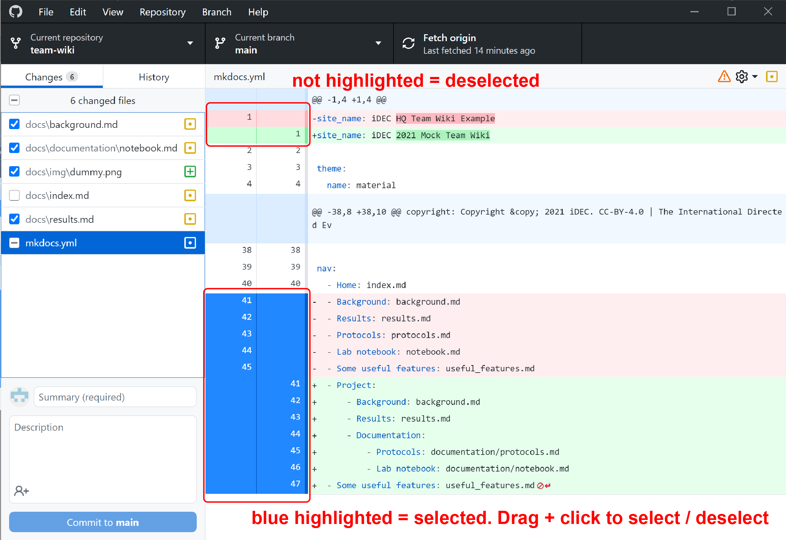
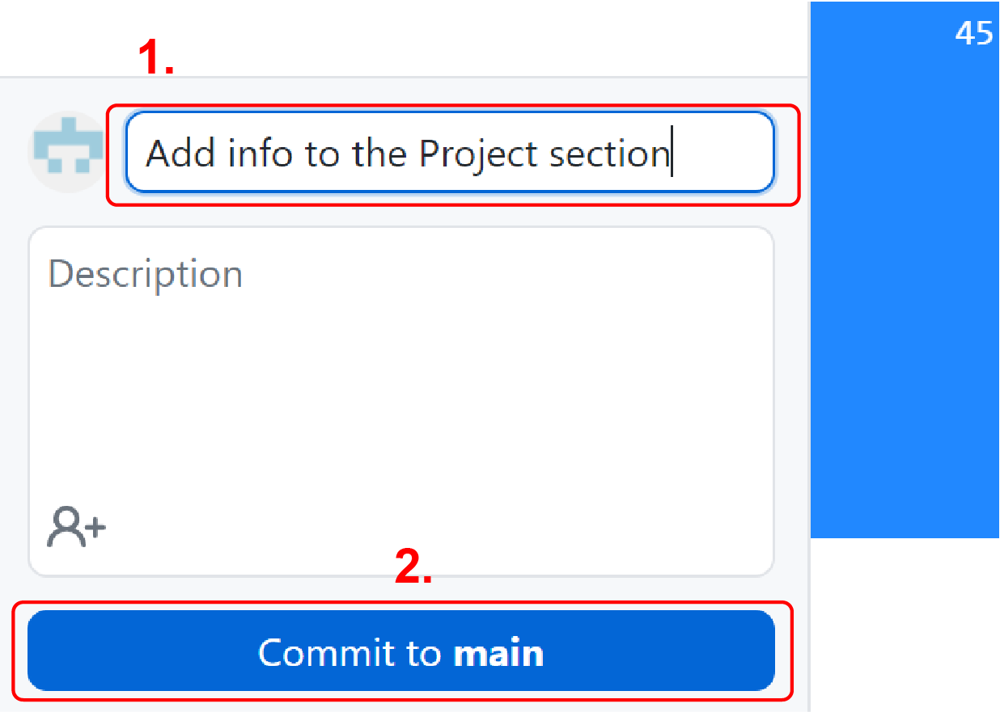
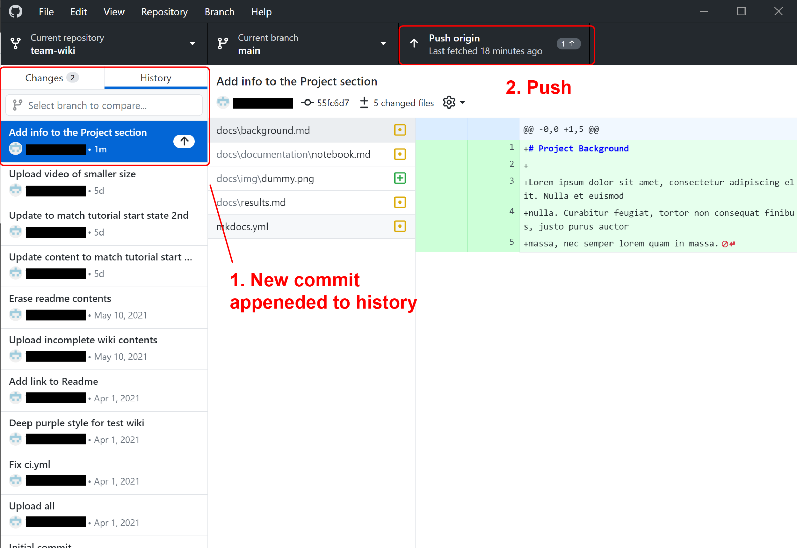

# Stage, Commit and Push changes

## Stage and commit to your local repository

1. Open GitHub Desktop. GitHub Desktop should detect the changes made under the `team-wiki` folder.  
   GitHub Desktop will show what files were modified.  
   Within each file (if they are plain text files), GitHub Desktop will also show what lines are added and what lines are deleted.  
    { width=600px }  
   In this screenshot, the file `mkdocs.yml` was being inspected by GitHub Desktop. Added lines are shown in green and deleted lines are shown in red.  

2. Once the changes are finalized, you **stage** and **commit** the changes.  
   This is to say, you prepare and then add a record to the **history** of changes that the version control software is keeping track of.  
   You can select the specific files *and* the specific lines to commit.  

3. **Stage** your changes  
   Select only the files:  
    - `docs/background.md`  
    - `docs/documentation/notebook.md`  
    - `docs/img/dummy.png`  
    - `docs/results.md`  
   Deselect the file `mkdocs.yml`  
   Then, drag and select deletions of lines 41-45 and addition of lines 41-47  
   { width=600px }  
   By doing so, you have selected changes that are relevant to the Project section of the wiki, and you signal to GitHub Desktop that these changes are ready to be committed.

4. **Commit** your changes
   In the lower left corner of GitHub Desktop, inside the "Summary" form, write:
   `Add info to the Project section`  
   Then click the blue "commit to main" button below.
   { width=400px }  

!!! tip
    It is always a good habit to leave a commit message that concisely summarizes what your changes are. For example, "Add references for Genome Evolution page" is better than "Update Genome Evolution"  
    [Read more](https://chris.beams.io/posts/git-commit/) on how to write better commit messages.

## Push to your remote repository

1. Click on the "History" tab, you will now see the lastest commit being appended to the history of changes

2. At this point, this commit is appended to your _local_ repository on your computer, but not yet on your _remote_ and _forked_ repository hosted on GitHub  
   To proceed, "push" the commit  
   { width=600px }  

3. Open a browser, travel to your forked repository on GitHub, the address should look be:  
   `https://www.github.com/{your username}/team-wiki`  
   Two points to note here:
    - Your lastest commit message should be displayed above the repository contents  
    - GitHub should compare your history against ours and display a message saying:  
   `This branch is 1 commit ahead of idec2021:main.` (assuming you did not commit more changes)  
   { width=600px }  

You now have the change saved to both your local and remote repositories. At this point, other changes that were made before, e.g. changing site name, adding video to the home page, have not been added to the history of changes. If you want these changes to be permanent and sharable, you will need to stage and commit these changes as well.

## (Optional & Advanced) Deploy the site as a GitHub page on your account

Following the previous section, you now have a copy of the `team-wiki` under your GitHub account, and it is ready to be deployed as a [GitHub Pages](https://pages.github.com/), which is a website hosted by GitHub. If you wish to, you can enable GitHub Action and then [configure the Pages setting](gh_pages.md) under your repository, such that the site is deployed from the **gh-pages** branch. Doing so would create a website that can be accessed at:
`https://{your username}.github.io/team-wiki/`  
This allows you to visualize how this site would look from the internet.

The GitHub Action `.github/workflows/ci.yml` file is configured to update the **gh-pages** branch every time a "push" action is done to the repository. So you might to have to wait till the next change is pushed to see the site being deployed. There is also usually a 1 minute delay between the completion of GitHub Action and the update of the deployed site.